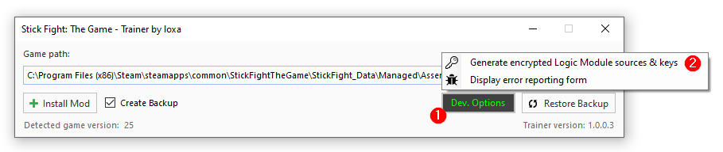

# Stick Fight: The Game Trainer
A trainer / mod for Stick Fight: The Game that supports both local and online multiplayer modes (via steam).

Injecting IL code directly into the game's Assembly-CSharp.dll file allows this trainer to work accross all versions, including future updates. The intention is to have a maintenance-free trainer that does not need to reflect changes that are made to every update of the game. 

### Features (+12)

- No recoil
- Full auto
- Scoreboard
- Flying mode
- Skip map/boss
- Display health
- Uncap fire-rate
- Unlimited health
- Unlimited ammunition
- Spawn weapon on demand (extra weapons)
- Browse and select weapons (extra weapons)
- Spawn different AI Bots / Single Player mode

Now supports playing online (cheats off), and with friends (cheats on).

### Project Building

The `Build Action` property is set to `None` for the following source code files.

- `/Trainer/TrainerLogic/Singleton.cs` (Generic singleton to allow reusing instances of TrainerManager and TrainerOptions)
- `/Trainer/TrainerLogic/TrainerManager.cs` (Contains most of the logic and UI)
- `/Trainer/TrainerLogic/TrainerOptions.cs` (Basic settings store)

These files are compiled at run-time during the trainer patching process using `System.CodeDom.Compiler.CodeDomProvider`. Several of the game's own reference DLLs are expected to be discovered in the 
same directory as the user-supplied target `Assembly-CSharp.dll` file, including `UnityEngine` and `TextMeshPro`. Important to note that the output binary is built with .NET Framework 3.5 to match the game's build.

Following successful compilation, the produced binary is immediately reloaded. Finally, the newly compiled `TypeDef`s are injected into the game's target `Assembly-CSharp.dll` file.

As a basic tampering prevention measure, the raw source files are encrypted with the use of AES 256, and are only momentarily decrypted at run-time for the aforementioned compilation step. 

A utility is available when the VS project is built in `Debug` mode to assist with this task. Pressing the `Dev. Options` button brings up the `Generate encrypted Logic Module sources & keys` option. 
This will load the three relevant `.cs` files and generate correspondingly named `.data` files, along with two additional files called `iv.data` and `key.data`.

Finally, the generated data must be *hard coded* within the `StickFightTheGameTrainer.Trainer.TrainerLogic.TrainerLogicModule` static class. While this is far from ideal,
it prevents script-kiddies from enabling cheats in online public lobbies.

Please note that when installing the patch in `Release` mode, the target assembly is additionally obfuscated with the use of ConfuserEx.

### Installation

1) Unzip / extract the downloaded .zip file.
2) Run the extracted trainer .exe program.
3) Specify the path to your Stick Fight The Game installation folder.
- Most common Steam location: `C:\Program Files (x86)\Steam\steamapps\common\StickFightTheGame\StickFight_Data\Managed`
4) Press `Install Mod` button.

### Controls
##### PC Keyboard

    - Toggle Trainer Menu: [SHIFT] + [M]
    - Skip Map: [SHIFT] + [S]
    - Spawn Random Weapon: [R] or [P]
    - Browse Weapons: [Q] for previous or [E] for next

##### Xbox 360 Controller

    - Toggle Trainer Menu: [RB] + [A]
    - Skip Map: [RB] + [B]
    - Spawn Random Weapon: [DPadUp] or [DPadDown]
    - Browse Weapons: [DPadLeft] or [DPadRight]

### Notes

    - The scoreboard displays wins (i.e. how many rounds you wear the crown for).
    - When you skip a level, no one wins the round.
    - This mod will only activate if you're playing locally or with other players that have it installed.
    - HP bars always display 100, even if your health is set to 300. Damage is scaled relatively.

### Release Information

##### Version 1.0.0.3 (Game version v1.2.06 and above)
- Improved AI logic.
- Hold weapon selection shortcuts to browse quickly.

##### Version 1.0.0.2 (Game version v1.2.06 and above)
- Added AI Bots / Single Player mode.
- Improved shortcuts.
- Spawn weapons as presents.
- Bug fixes and major performance improvements.

##### Version 1.0.0.1 (for all versions of the game)
- Added support for newer versions of the game (no regression in compatibility).
- Minor bug fixes and improvements.

##### Version 1.0.0.0 (for all versions of the game)
- Automated installer for all versions of the game.
- Bug fixes.

##### Build 05 (Game version v1.2.04) - *Not Included*
- Bug fixes.
- Added unlimited health.

##### Build 04 (Game version v1.2.03 LET v1.1) - *Not Included*
- Added an FPS counter.
- Online mode is now available.
- Other general bug fixes and improvements.

##### Build 03 (Game version v1.2.03) - *Not Included*
- Online mode is now restored, although still without the trainer itself.
- General bug fixes and improvements.
- HP bars & scoreboard no longer disappear when a player dies.

##### Build 02 (Game version v1.2.0) - *Not Included*
- Corrected a bug where pressing RB would sometimes cause the player's stick fighter to fly.
